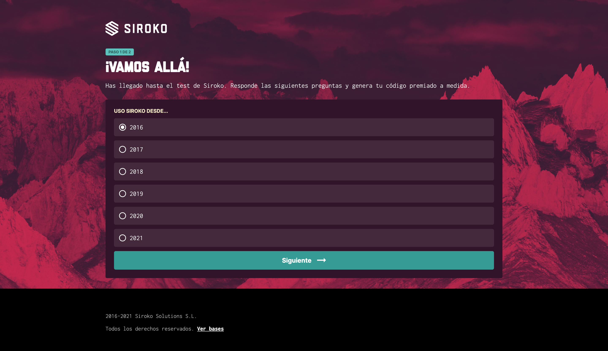

# Prueba Técnica Maquetación - Techpump

Maquetación de página web a partir de los diseños facilitados en Figma.

## 🔗 Enlace a web

## 🛠 Herramientas utilizadas

- HTML
- SCSS
- Javascript
- Figma

## 🖥 Vista previa

